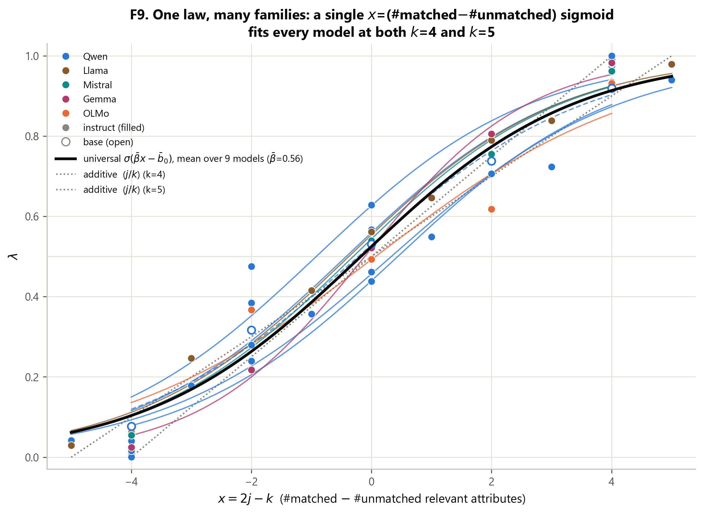
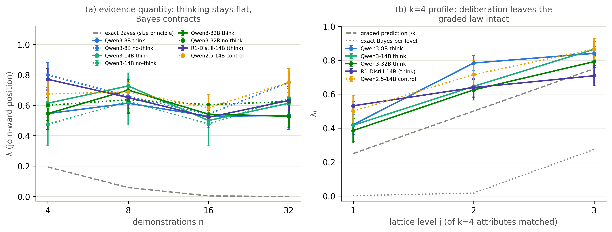
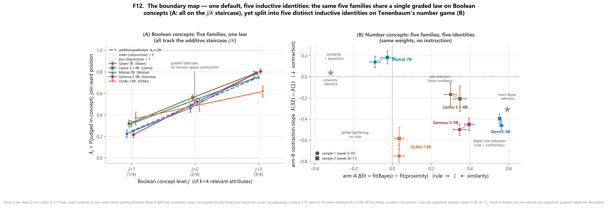

# λ-lattice

**A pre-registered instrument that measures *where* a language model sits
between similarity-based and rule-based induction — and whether it applies the
Bayesian size principle.**

*An instrument of the **Echo Space** research program — studying lattice and
closure structure (meets, joins, version spaces) in learned representations.*

[](https://github.com/MGALIKE/lambda-lattice/actions/workflows/ci.yml)
[](LICENSE)
[](https://www.python.org/)
[](preregistrations/)

---

Give an LLM in-context demonstrations that **underdetermine** a concept. The
hypotheses consistent with the demos form a lattice interval — from the
version-space **meet** (the logical closure of the positives) up to the
**join**. A probe that satisfies exactly *j* of the *k* relevant attributes
locates the model on that interval. That coordinate is **λ**, and sweeping it is
the whole instrument.

Point the same instrument at two domains and you get a clean, surprising map of
how today's models generalize:

- **On Boolean attribute concepts**, generalization is a **family-universal
  graded similarity default** — `λ_j ≈ j/k`, the city-block Generalized Context
  Model — across **5 model families, 0.5B–32B, base and instruct, 31/31
  measured cells**. No version-space contraction, no rule-shift with scale.
- **Reasoning training doesn't change that inductive bias** — it buys *faithful
  execution of an instructed inference policy*. A three-way dissociation
  separates the **operation** (elicitable), the **statistic** (elicitable only
  when stated outright), and the spontaneous **policy** (absent at every level).
- **Hypothesis-space induction is domain-gated.** Ported to Tenenbaum's number
  game, the *same weights*, uninstructed, are decisively **rule-like** with
  **size-principle contraction at near-reference magnitude** — in both thinking
  and non-thinking modes.

Every headline was pre-registered *before* its run (`preregistrations/`), every
number here traces back to a raw JSON in `data/`, and mixed/negative outcomes
are reported as such.



---

## Install

```bash
pip install -e .              # numpy + scipy + matplotlib (the instrument + scorers)
pip install -e ".[models]"    # add torch + transformers to run real models
pip install -e ".[vllm]"      # add vLLM for fast reasoning-model generation
```

## Quickstart (3 lines, no GPU)

```bash
lambda-lattice selftest                                   # mock-oracle recovery check
lambda-lattice score numbers data/echo_numgame_q8.json    # the number-game verdicts
lambda-lattice figures                                    # regenerate F1–F14 into figures/
```

The `selftest` runs the number-game instrument on two *planted* oracles and
confirms the pre-registered scorer recovers their identities end-to-end
(Bayes → RULE + contraction PRESENT; proximity → SIMILARITY + contraction
ABSENT) — the same power check the number-game pre-registration requires before
any model data are scored.

### Python API

```python
import lambda_lattice as ll

# no-GPU oracle power check
res = ll.run_numbergame({"models": "bayes:none,prox:none",
                         "backend": "mock", "seeds": 36,
                         "out": "results/mockcheck.json"})
verdicts = ll.score("numbers", "results/mockcheck.json")

# run the Boolean instrument on a real model (needs torch + transformers)
ll.run_boolean({"models": "Qwen/Qwen2.5-7B-Instruct", "krel": 4,
                "seeds": 16, "ndemos": 8, "formats": "f1,f2,f3"})
```

The exact reference learners are importable and unit-tested on their own:

```python
from lambda_lattice import references as R
R.additive(2, 4)                 # 0.5   — the observed graded/GCM law
R.bayes_predict([10, 20, 30, 40], [25])[25]   # size-principle posterior predictive
len(R.HSPACE)                    # 5082  — 32 number-game rules + 5050 intervals
```

---

## Results

### 1 · The default policy: one graded law, many families

Across **5 model families (Qwen, Llama, Mistral, Gemma, OLMo), 0.5B–32B, base
and instruct, 31/31 measured cells**, uninstructed ICL on this instrument
follows

> P(item judged in-concept) ≈ σ(β·(#matched − #unmatched attributes) − b₀)

— a graded, additive similarity profile: the signature of **Generalized Context
Model / prototype-style similarity integration** (Nosofsky 1986). On this design
the profile is algebraically the city-block GCM, so we frame it as the model's
**default generalization policy**, not a "law of ICL."

**Pre-registered, blind-confirmed twice:**

1. The graded profile `λ_j ≈ j/k`, predicted at k=4 (0.25/0.50/0.75) and k=5
   (0.2/0.4/0.6/0.8) *before* the runs, observed within ~2 seed-clustered SE at
   k=4 and **6/6 cells graded at k=5**.
2. **No version-space contraction**: the Bayesian size-principle prediction
   (λ→0 with more demos) never appears — λ is flat from n=4 to n=32, at every
   scale to 32B.
3. **No rule-shift with scale**: 32B is as graded as 0.5B on this instrument.
4. The exemplar-vs-prototype *residue* is model-dependent (pre-registered
   Amendment 3): **Qwen shows GCM-like sensitivity to irrelevant-attribute
   overlap, pooled z = 6.96; Llama does not, z = 2.82** (below threshold) —
   both reproduced by `lambda-lattice score gcm data/jbias_gcm_test.json`.

| reference learner | k=4 prediction (λ₁, λ₂, λ₃) |
|---|---|
| version-space meet (logical closure) | 0, 0, 0 |
| Bayes size-principle | ≈0.00, ≈0.02, ≈0.27 |
| 1-NN (Hamming) | low, low/high tie, high (step) |
| join (any-attribute) | 1, 1, 1 |
| **additive / GCM (observed)** | **0.25, 0.50, 0.75** |

### 2 · Reasoning training teaches the operation, not the statistic

Applying the instrument to RL-trained reasoning models — using the model's own
thinking toggle as a **same-weights causal switch** — yields a pre-registered
**three-way dissociation**:

1. **No spontaneous hypothesis-space management.** The thinking toggle is null
   at 8B/14B/32B (think−no-think d = +0.050 / +0.039 / −0.036, all |z| < 1.4);
   profiles stay graded; and in **60/60** sampled reasoning traces there is no
   elimination language — **deliberation narrates similarity**. (gpt-oss-20b
   was excluded by the pre-registered parse gate at both a 6144- and a
   14336-token budget — see the Amendment E section below — so the toggle
   null is Qwen-family-only; its passing low-effort cell is flat and
   evidence-insensitive like every other measured cell.)
2. **The intersection *operation* is elicitable.** One-pass version-space
   instruction inside RL-trained deliberation collapses λ̄ **0.699 → 0.211**
   with calibration intact — controllability, not a changed inductive bias.
3. **The evidence *statistic* moves only when stated outright.** Under an
   instruction that explicitly states the size principle, contraction replicates
   under the pre-committed two-sample rule: −0.169 (z = −2.21) on 36 seeds,
   −0.105 (z = −1.71, same sign) on 36 fresh seeds, **pooled −0.136
   (z = −2.81, 68 paired seeds)**. Real but shallow: ~0.14 of contraction
   against the exact-Bayes reference's 0.19 → 0.000.



| condition | think−no-think (paired) | λ(n=32)−λ(n=4) | profile |
|---|---|---|---|
| Qwen3-8B think vs no-think | +0.050 (z=+1.24) | +0.000 (z=0.00) | graded 0.42/0.78/0.84 |
| Qwen3-14B think vs no-think | +0.039 (z=+0.54) | +0.000 (z=0.00) | graded 0.42/0.65/0.86 |
| Qwen3-32B think vs no-think | −0.036 (z=−1.34) | −0.015 (z=−0.12) | graded 0.39/0.62/0.79 |
| R1-Distill-14B vs 14B control | — | −0.139 (z=−1.45, ns) | graded 0.53/0.64/0.71 |

**Verbal report vs decision policy.** The traces *contain* rule talk, yet the
stated conjunctions are never applied as meets: single-attribute rule
consistency ≥ 0.9 occurs in **0%** of thinking trials (8% in the non-reasoning
control), and every profile is graded. Models **talk rules and compute
similarity** — a quantitative probe of chain-of-thought faithfulness.

**Not an accuracy lever.** On disambiguated true-AND concepts, instructed-meet
vs direct was +0.049 (z=+1.74) on a first 12-seed sample and **−0.014
(z=−1.10)** on a pre-registered 36-fresh-seed replication (pooled 48 seeds:
+0.002, z=+0.14) — dead by the two-miss rule (Amendments C/C′). Its only
replicated effect is eliminating rare overcoverage errors (pooled z=−2.07).

### 3 · The domain boundary: Tenenbaum's number game

The second pre-registered pillar (`preregistrations/PREREGISTRATION_NUMGAME.md`,
frozen before any model run) moves the full instrument to hidden integer
concepts on [1,100], with probe strata built to **decorrelate rule membership
from numeric proximity**. The per-trial reference is **exact Bayes over
Tenenbaum's hypothesis space** — **32 mathematical rules + all 5050 intervals
[a,b] ⊆ [1,100]** (strong sampling `P(D|h)=|h|^(−n)`, Erlang length prior) — set
against a numeric-proximity similarity reference.

Result — replicated on two independent 36-seed samples, claimed under the
pre-committed two-sample rule:

| sample | mode | Δfit (rule vs similarity) | λ_in / λ_off / λ_broad | contraction slope λ(32)−λ(1) |
|---|---|---|---|---|
| 1 (seeds 0–35) | think ON | +0.587 ± 0.008 (z=+72.5) | 0.992 / 0.000 / 0.024 | −0.562 ± 0.113 (z=−4.97, 8 seeds) |
| 1 (seeds 0–35) | think OFF | +0.561 ± 0.011 (z=+51.3) | 0.993 / 0.007 / 0.104 | −0.461 ± 0.048 (z=−9.63, 19 seeds) |
| 2 (seeds 36–71) | think ON | +0.568 ± 0.007 (z=+84.3) | 1.000 / 0.000 / 0.017 | −0.417 ± 0.082 (z=−5.09, 8 seeds) |
| 2 (seeds 36–71) | think OFF | +0.552 ± 0.010 (z=+56.8) | 0.993 / 0.000 / 0.090 | −0.396 ± 0.045 (z=−8.81, 24 seeds) |

The same weights that stay graded and flat on Boolean concepts select the
narrowest consistent rule and contract λ(n) toward the exact-Bayes reference,
uninstructed, in both decode modes. **Hypothesis-space induction in LLMs is
domain-gated: present and near-normative on number concepts, absent on
multi-attribute Boolean concepts — and not dependent on reasoning-mode
deliberation.**

Before any model data, a **mock-oracle power check** verified the instrument
recovers both identities end-to-end from the prompt text (Bayes oracle:
Δfit +0.592, slope −0.309 at z=−6.5; proximity oracle: Δfit −0.317, flat slope;
slope SE ≈ 0.047 at 36 seeds). That check is `lambda-lattice selftest`.

---

## The cross-family sweep: one default, five inductive identities

The pre-registered cross-family sweep (Amendment NG-F, frozen before any
run; two independent 36-seed samples per family, identical instrument and
scorer) asked whether the number-game result is family-universal. The frozen
universality bar (≥ 3 of 4 families RULE-like *and* contraction-PRESENT)
was **not met — and the failure is the finding.** Every family reproduces
its own distinct profile across both samples:

| family (:off) | Δfit S1 / S2 | slope λ(32)−λ(1) S1 / S2 | in-rule-far slope | replicated profile |
|---|---|---|---|---|
| Qwen3-8B (above) | +0.561 / +0.552 | −0.461 / −0.396 (z −9.6 / −8.8) | **positive** (+0.06…+0.18) | **Bayes rule induction** (off-rule dies, in-rule rises) |
| Gemma-2-9B | +0.345 / +0.394 (z 10.7 / 16.2) | −0.500 / −0.450 (z −9.4 / −7.6) | −0.61 / −0.55 | rule + contraction, with a global-tightening component |
| Llama-3.1-8B | +0.300 / +0.347 (z 10.1 / 10.7) | −0.167 / −0.208 (ns ×2) | ≈ 0 | **rule selection, frozen evidence** (no resolvable dynamics) |
| OLMo-2-13B | +0.034 / +0.035 (ns ×2) | −0.750 / −0.583 (z −7.4 / −5.5) | −0.63 / −0.58 | **tightening without rules** (everything collapses toward the demos) |
| Mistral-7B-v0.3 | −0.089 / −0.026 | **+0.140 / +0.183** (z +2.6 / +3.0) | ≈ 0 | **similarity + expansion** (proximity-ordered strata, λ grows with n) |

Only Qwen3-8B shows the full Bayesian signature — off-rule acceptance
collapsing *while in-rule-far acceptance rises*. Gemma reproduces the two
headline verdicts (rule positioning + contraction) but with in-rule
acceptance also falling at large n; the others each do something different,
and each does it twice.

The exploratory synthesis (flagged as post-hoc — this contrast was not a
pre-registered hypothesis): the same five families that are **homogeneous on
Boolean concepts** (31/31 cells on one graded default) are **heterogeneous
on number concepts** (five distinct, individually replicated profiles).
The similarity default is family-universal; hypothesis-space induction is
family-idiosyncratic. Domain-gating is real, but what sits behind the gate
depends on the model — which sharpens the reconciliation reading: rule-like
number-game results (2512.20162) and graded-similarity results are both
right, *and which one you get depends on both the domain and the family*.



## The gpt-oss-20b cells (Amendment E: the exclusion is the result)

The pre-registered escalated-budget rerun (Amendment E, frozen before the
run) attempted to break the Qwen-family monoculture of the toggle result:
gpt-oss-20b at reasoning effort high vs low, max_new_tokens 14336 (the
budget that cured Qwen3-8B's truncation). Outcome, per the frozen
no-second-escalation rule:

- **High effort fails the parse gate again** (parse 0.74; 26% truncation;
  mean deliberation 11.4k chars) — the toggle contrast is unevaluable, and
  the toggle-null question for non-Qwen reasoners remains open (candidates:
  GLM/EXAONE/Phi-4-reasoning-class togglable models).
- **Low effort passes every gate** (parse 1.00, 174/180 learned): λ̄ = 0.507,
  profile 0.43/0.49/0.61, λ(n) slope +0.000 (z = 0.00, 32 seeds), 0%
  rule-committed trials — a frontier open-weights reasoner at minimal effort
  lands on the same flat, evidence-quantity-insensitive default (descriptive
  cell; the pre-registered contrast needed both conditions).
- **Descriptive, survivor-biased, reported without claim:** among the high
  condition's surviving trials, the pre-registered rule-commitment
  discriminator fires for the first time in any model — **86% of trials are
  rule-committed** (baseline 9–21%), with the aggregate profile staying
  graded exactly via the random-rule-choice mechanism the prereg
  anticipated. The companion number-game cell (also excluded, parse 0.499)
  is consistent: its survivors are perfectly rule-like (λ_in = 1.000,
  λ_off = λ_broad = 0.000). When gpt-oss-20b's deliberation terminates, it
  commits to discrete rules in both domains — but the cells fail the frozen
  gates, so this is reported descriptively only.

---

## Repository layout

```
src/lambda_lattice/
  references.py         the exact reference learners (importable, unit-tested)
  boolean/harness.py    the λ instrument for Boolean concepts (env-var CLI + run())
  boolean/reasoning.py  the reasoning-model (generation) variant
  numbers/harness.py    the Tenenbaum number-game port (+ no-GPU mock backend)
  scoring/              importable scorers: jbias, gcm, sizep, numbers
  figures/              the F1–F14 figure pipeline
  cli.py                lambda-lattice run-boolean | run-numbers | score | figures | selftest
preregistrations/       the three verbatim pre-registration ledgers + how to verify
data/                   every raw per-probe result JSON reported anywhere
figures/                F1–F14 (300 dpi PNG; regenerable)
paper/                  the article lands here
tests/                  reference-learner unit tests + the mock-oracle credibility test
```

## Reproduce a real run

```bash
# instrument (any HF causal LM; ~10 min on an A100 for a 7B):
lambda-lattice run-boolean --models Qwen/Qwen2.5-7B-Instruct --krel 4 \
  --seeds 16 --ndemos 8 --formats f1,f2,f3 --out my_run.json

# figures:
lambda-lattice figures
```

## Provenance & honesty

Every headline number was reproduced by an independent adversarial audit
(recomputation from raw JSON, seed-clustered errors, harness code audit, git
timestamp verification of the pre-registrations). The audit also *corrected*
earlier framings: a claim that the profile "rejects exemplar models" was wrong
(it rejects only the 1-NN limit) and is withdrawn, and the uninstructed profile
is presented as a **default policy measured by the instrument**, not a new law
of cognition. Mixed and negative pre-registered outcomes are reported as such —
including the two-miss death of the accuracy lever (C/C′) and the size-principle
elicitation result being claimed only via the pooled decision rule pre-committed
before its replication ran (D/D′). The logprob-based λ is cross-validated by
free generation (chat-generation λ = 0.479 vs logprob λ = 0.454 at 7B).

This standalone release changed **no numeric logic** relative to the
pre-registered source — it is a packaging/adaptation of paths and imports only.
See [`CONTRIBUTING.md`](CONTRIBUTING.md) for the rule that keeps it that way.

## Citation

See [`CITATION.cff`](CITATION.cff). License: [MIT](LICENSE).
