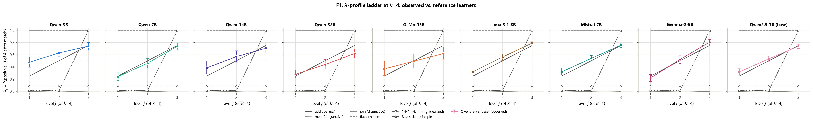
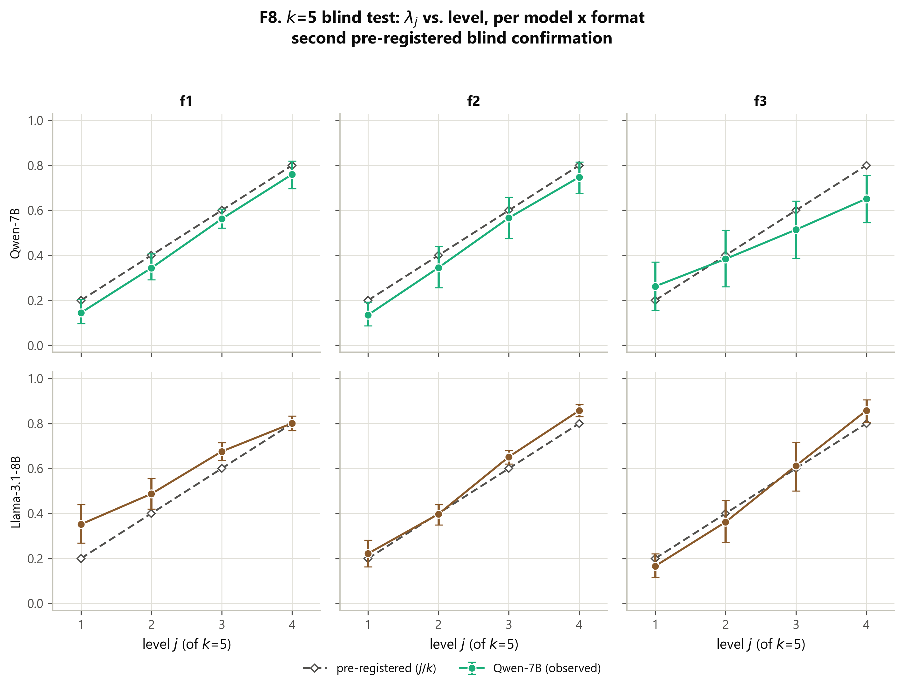
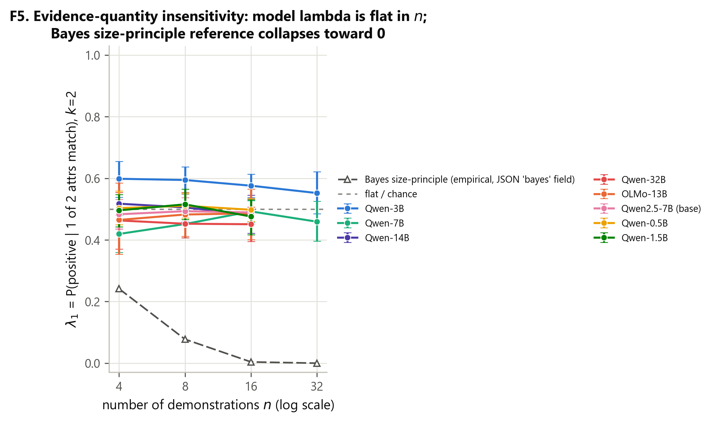
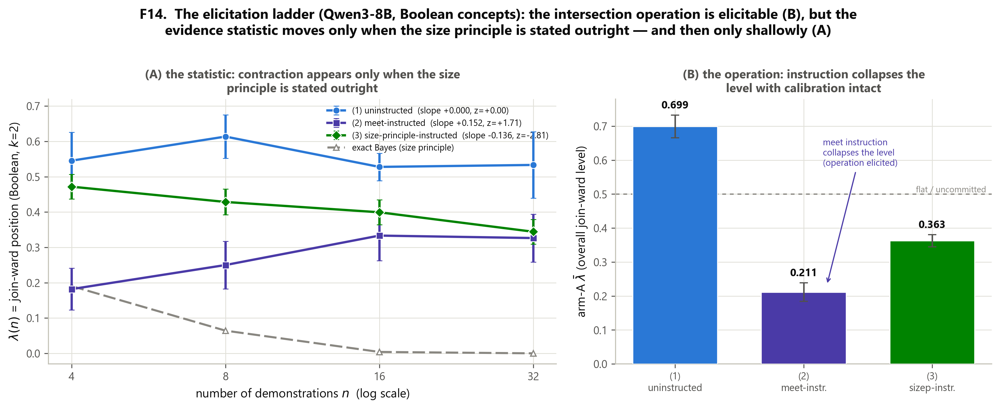
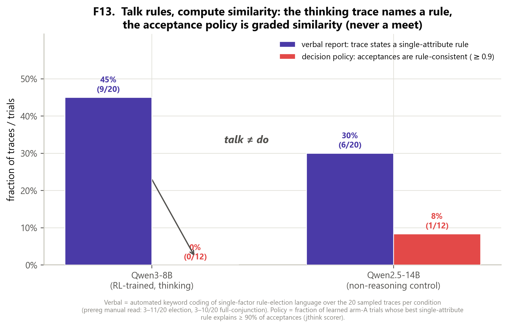
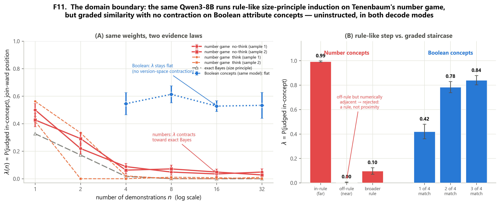

# Talk Rules, Compute Similarity: Domain-Gated Hypothesis-Space Induction in Language Models

*A pre-registered instrument for locating where a language model sits between similarity-based and rule-based in-context induction — and whether it applies the Bayesian size principle.*

---

## Abstract

Does a large language model generalize a concept it has just seen demonstrated in context by computing graded similarity, or by selecting a discrete rule and applying the Bayesian size principle? The literature answers both ways, on different tasks. We build a pre-registered *instrument* rather than a benchmark: given demonstrations that logically **underdetermine** a concept, the consistent hypotheses form a lattice interval from the version-space meet (the logical closure of the positives) up to the join, and a probe that satisfies exactly *j* of the *k* relevant attributes locates the model on that interval at coordinate **λ**. Paired with exact per-trial reference learners (version-space meet, exact Bayes size principle, GCM/proximity, 1-nearest-neighbor, join), the instrument reads off *which* learner a model behaves like. On Boolean attribute concepts, generalization is a family-universal graded-similarity default, `λ_j ≈ j/k` — algebraically the city-block Generalized Context Model — across five families (Qwen, Llama, Mistral, Gemma, OLMo), 0.5B–32B, base and instruct, in 31 of 31 measured cells, blind-predicted before the runs at *k*=4 and *k*=5, with no version-space contraction and no rule-shift with scale. Applying the instrument to RL-trained reasoning models through their own thinking toggle as a same-weights causal switch yields a three-way dissociation: the intersection **operation** is elicitable (λ̄ 0.699→0.211, calibration intact), the size-principle **statistic** is elicitable only when stated outright (pooled −0.136, z=−2.81, 68 seeds), but the spontaneous **policy** of using either is absent at every level (toggle null at 8B/14B/32B, all |z|<1.4; 0/60 traces acknowledge ambiguity). Ported to Tenenbaum's number game, the *same weights*, uninstructed, in both decode modes, are decisively rule-like with size-principle contraction at near-reference magnitude (Δfit +0.55…+0.59; slope −0.40…−0.56). A cross-family number-game sweep shows the domain gate is itself family-dependent: five families that are homogeneous on Boolean concepts split into five distinct, individually replicated number-game profiles. Hypothesis-space induction in LLMs is domain-gated, not absent and not reasoning-training-dependent; what lies behind the gate depends on the family. Every headline was pre-registered before its run, every number traces to a committed raw JSON, and every kill, exclusion, and deviation is reported as such.

---

## 1. Introduction

A recurring question about in-context learning (ICL) is *what kind of learner* a language model imitates when it generalizes from a handful of demonstrations. Two accounts have accumulated evidence on different tasks. The **similarity** account holds that models integrate graded feature overlap, in the manner of exemplar and prototype models from the psychology of categorization; the **rule** account holds that models entertain a structured hypothesis space, select a consistent hypothesis, and — in its Bayesian form — apply the *size principle*, trusting the narrowest consistent rule more sharply as consistent evidence accumulates (the "suspicious coincidence" of many positive examples all falling inside a small set). The tension is sharp because the accounts make opposite quantity predictions: a similarity learner's generalization is flat in the number of demonstrations, whereas a size-principle learner's generalization *contracts* toward the narrowest rule as demonstrations pile up.

Most existing work compares model outputs to a single account on a single task, and reports a fit. That design cannot separate "the model is a similarity learner" from "this task does not distinguish the accounts." What is missing is an *instrument*: a stimulus construction and scorer that, on every trial, computes what each candidate learner would predict, so that a model's behavior can be *located* among them rather than merely correlated with one. This paper builds and pre-registers such an instrument and points it at two concept domains.

The distinction between an instrument and a benchmark is doing real work here. A benchmark asks "how well does the model do the task"; it collapses behavior to a scalar score against a fixed ground truth. But the question of *what kind of learner* a model is has no ground truth — the demonstrations are underdetermined precisely so that meet, Bayes, GCM, 1-NN, and join all remain consistent — so there is nothing to be "correct" about. What one wants instead is a coordinate system in which each of those learners occupies a known position, so that the model's behavior can be read off as a location, and so that dynamics (how the location moves as demonstrations accumulate, or as scale grows, or as a domain changes) become the observable. That is what λ provides: not a score but a coordinate, and the whole apparatus of exact per-trial references is what turns that coordinate into an interpretable reading. It also means a *null* — a flat λ where a rule learner predicts contraction — is a positive measurement, not a failure to find an effect, because the reference learner tells us exactly how large the missing effect would have been.

The core construction is a lattice. Demonstrations that underdetermine a concept leave a set of consistent hypotheses, and under a closure reading these form an interval from the version-space **meet** — the logical closure (intersection) of the positive examples, the narrowest consistent hypothesis — up to the **join**, the most permissive. A probe item that satisfies exactly *j* of the *k* relevant attributes sits at a known rung of that interval, and the model's acceptance rate on such probes is a coordinate **λ** on it. λ≈0 is meet-like (accept only the closure); λ≈1 is join-like (accept anything sharing an attribute); a graded λ that tracks *j/k* is the signature of additive, similarity-style evidence integration. Sweeping λ across rungs, across the number of demonstrations *n*, and across model families and scales *is* the instrument. Because the exact reference learners are computed per trial, the instrument reports not just "how graded" but "which of meet, Bayes, GCM, 1-NN, or join this looks like."

We report four things.

**Contributions.**

- **An instrument, not a benchmark.** A pre-registered lattice-position probe λ_j paired with five exact per-trial reference learners (version-space meet, exact Bayes size principle, GCM/proximity, 1-nearest-neighbor, join). It is validated three ways: mock-oracle recovery in both domains (planted oracles are recovered end-to-end from prompt text), a learned-trial gate that is a no-op on the verdict, and a logprob-vs-generation cross-check (λ = 0.454 by label logprob vs 0.479 by free chat generation at 7B). §2.
- **A family-universal similarity default on Boolean concepts.** `λ_j ≈ j/k` across 5 families, 0.5B–32B, base and instruct, in 31/31 measured cells, blind-predicted before the runs at *k*=4 (0.25/0.50/0.75) and *k*=5 (0.2/0.4/0.6/0.8). On this design the profile is algebraically the city-block GCM, so we frame it as the model's *default generalization policy*, not a new law of cognition. No version-space contraction appears anywhere; 32B is as graded as 0.5B. §3–§4.
- **A three-way dissociation in reasoning models.** Using an RL-trained model's own thinking toggle as a same-weights causal switch: the intersection **operation** is elicitable (λ̄ 0.699→0.211, calibration intact); the size-principle **statistic** is elicitable only when stated outright (pooled −0.136, z=−2.81); the spontaneous **policy** of using either is absent at every scale (toggle null at 8B/14B/32B). The traces *talk rules and compute similarity* — a quantitative chain-of-thought-faithfulness probe. §5.
- **A domain gate, itself family-dependent.** Ported to Tenenbaum's number game, the same weights, uninstructed, in both decode modes, are decisively rule-like with size-principle contraction at near-reference magnitude. A cross-family sweep then shows the gate is family-dependent: the pre-registered universality bar is *not* met, and that failure is the finding — five families homogeneous on Boolean concepts split into five distinct, replicated number-game profiles. §6.

Throughout, the tone is deliberately unheroic. Negative and mixed outcomes carry equal weight with the positive ones; kills (the dead accuracy lever, §5.4), exclusions (gpt-oss-20b, §6.4), and deviations (OLMo context length, §8) are reported in full in the pre-registration ledger of §8. The uninstructed Boolean profile is a *default policy measured by an instrument*, stated plainly as the city-block GCM — not "a law of ICL." The reinforcement-learning-from-verifiable-rewards result that grew out of this program is deliberately *not* in this paper; it is a separate release, mentioned once in future work.

---

## 2. The λ instrument (Boolean concepts)

### 2.1 The lattice interval

An object is a conjunction of binary attributes. In the headline design there are *k* relevant attributes and (optionally) some irrelevant ones. Demonstrations are constructed so that the concept is *underdetermined*: the positives are all instances of the full conjunction A₁∧…∧A_k while the negatives are all instances of ¬A₁∧…∧¬A_k, so that each single attribute A_i, every partial conjunction, and the full conjunction are all consistent with the labeled data. The consistent hypotheses therefore span a lattice interval whose bottom is the version-space **meet** (the closure of the positives = the full conjunction, which accepts nothing outside it) and whose top is the **join** (accept anything matching at least one attribute).

The probes are *revealers*: held-out items that satisfy exactly *j* of the *k* relevant attributes, for *j* = 1, …, *k*−1. A meet-learner rejects every revealer (λ_j = 0 for all *j*); a join-learner accepts every revealer (λ_j = 1); a graded/additive learner accepts in proportion to how many attributes match. The instrument also includes **sanity** probes (the "both" item that satisfies all attributes, which must be accepted; the "neither" item, which must be rejected) used only for the learned-trial gate, never for λ.

### 2.2 λ and the strata

For each revealer level *j*, **λ_j** is the mean probability the model assigns to the positive label, read from the label-token logprob (or, in the reasoning variant, parsed from generated text). The headline scalar **λ̄** is the mean over learned trials. Labels are nonce tokens (e.g. "wug"/"dax") counterbalanced by seed to remove any yes-token response bias. Demonstration order is permuted per seed; probe order is counterbalanced; formats vary over adjective phrases (f1), key=value lists (f2), and numeric thresholds (f3) as a surface-form robustness control.

### 2.3 The reference learners

The instrument's power comes from computing, on every trial, what each candidate learner predicts for the same probes. The five references, importable and unit-tested on their own, are:

| reference learner | *k*=4 prediction (λ₁, λ₂, λ₃) | reads as |
|---|---|---|
| version-space meet (logical closure) | 0, 0, 0 | narrowest rule / echo-closure |
| Bayes size-principle | ≈0.00, ≈0.02, ≈0.27 | rule + evidence quantity |
| 1-NN (Hamming) | low, low/high tie, high (step) | nearest exemplar |
| join (any-attribute) | 1, 1, 1 | broadest rule |
| **additive / GCM (observed)** | **0.25, 0.50, 0.75** | graded similarity integration |

The additive/GCM reference is the graded prediction λ_j = *j*/*k*; the exact-Bayes reference is the size-principle posterior predictive over the concept hypothesis space; the 1-NN reference is a step function. These are not fit to model behavior — they are exact learners evaluated on the trial's demonstrations, so a model's λ-profile can be *located* among them. *(Provenance: reference learners in `src/lambda_lattice/references.py`; `R.additive(2,4)=0.5`, unit-tested in `tests/`.)*

### 2.4 Validation

Three pre-registered checks establish that the instrument measures what it claims.

**Mock-oracle recovery (both domains).** Sampling oracles that answer directly from the prompt text — a Bayes oracle and a proximity oracle — are recovered end-to-end by the scorer: in the number-game port (§6) the Bayes oracle yields Δfit +0.592 and a contraction slope −0.309 (z=−6.5), the proximity oracle yields Δfit −0.317 and a flat slope, precisely the identities planted. This is the `lambda-lattice selftest` power check that the number-game pre-registration required before any model data were scored. *(Provenance: `data/echo_numgame_mockcheck.json`; scorer `ng_analyze.py`.)*

**Learned-trial gate is a no-op on the verdict.** A trial counts toward λ only if its unambiguous-region accuracy is ≥ 0.75 (else the model learned nothing and λ is noise). Results are reported filtered and unfiltered; the gate changes power, not sign.

**Logprob vs generation cross-check.** The headline λ is read from label-token logprobs; the reasoning variant reads λ from free chat generation. At 7B the two agree — generation λ = 0.479 vs logprob λ = 0.454 — so the logprob readout is not an artifact of forced-choice scoring. *(Provenance: `data/jlever_7b.json`; scorer `scoring/jbias`.)*

---

## 3. The similarity default

### 3.1 One graded law, many families

Across **5 model families (Qwen, Llama, Mistral, Gemma, OLMo), 0.5B–32B, base and instruct, 31/31 measured cells**, uninstructed ICL on this instrument follows

> P(item judged in-concept) ≈ σ( β·(#matched − #unmatched attributes) − b₀ )

— a graded, additive similarity profile, the signature of Generalized Context Model / prototype-style similarity integration (Nosofsky 1986). On this design the profile is *algebraically* the city-block GCM (§3.3), so we frame it as the model's **default generalization policy**, not a law of ICL. Figure F9 shows the collapse: every family, every scale, lands on the same graded ladder.


*Figure F9. The graded similarity default across 5 families and 0.5B–32B. Each panel is a family; each line a scale. The uninstructed λ-profile is monotone graded and tracks the additive j/k reference, not the meet (flat 0), the join (flat 1), or the 1-NN step. 31/31 measured cells. (Data: `data/jbias_k4*.json`, `data/jbias_k5.json`; scorer `scoring/jbias`.)*

### 3.2 Blind predictions

The graded law was not fit and reported; it was *predicted before the runs* and confirmed blind, twice.

1. **The graded profile λ_j ≈ j/k**, predicted at *k*=4 (0.25/0.50/0.75) and at *k*=5 (0.2/0.4/0.6/0.8) before those runs, was observed within roughly 2 seed-clustered standard errors at *k*=4 and **6/6 cells graded at k=5**. Figures F1 (the k=4 ladder), F2 (prereg vs observed at 7B), F7 (the k=3 ladder that motivated the k=4 prediction), and F8 (the k=5 blind test) document the prediction-then-confirmation sequence.
2. **No version-space contraction.** The Bayesian size-principle prediction (λ→0 as demonstrations accumulate) never appears: λ is flat from *n*=4 to *n*=32, at every scale to 32B, while the exact-Bayes reference contracts (≈0.11→0.03 over the same sweep). Figure F5.
3. **No rule-shift with scale.** 32B is as graded as 0.5B on this instrument; there is no emergence of rule-like contraction with scale. Figures F3 (monotonicity grid) and F4 (logistic fits).



*Figure F1. The k=4 λ-ladder. Observed λ_j against the five reference learners; the model sits on the additive j/k rung (0.25/0.50/0.75), well away from the meet (flat 0), join (flat 1), 1-NN step, and Bayes contraction curve. (Data: `data/jbias_k4.json`; scorer `scoring/jbias`.)*



*Figure F8. The k=5 blind test. The additive law predicts λ_j ≈ 0.2/0.4/0.6/0.8 with no new free parameters; 6/6 cells land graded and monotone. (Data: `data/jbias_k5.json`; scorer `scoring/jbias`.)*

The prediction-then-confirmation sequence deserves emphasis because it is what separates a discovered regularity from a fit. The k=3 profile (Figure F7) was measured first and suggested λ_j ≈ j/k. The k=4 spacing (0.25/0.50/0.75) and then the k=5 spacing (0.2/0.4/0.6/0.8) were each written into the pre-registration *before* the corresponding run, with explicit kill criteria — a step-like profile (λ₁≈λ₂ low, λ₃ high) would have indicated a 1-NN/prototype threshold rather than additive integration; a flat profile (all ≈0.5) would have indicated indifference; a non-monotone profile would have killed the law outright. None of those fired: the order and near-equal spacing held, blind, twice, across the family roster.

*(Provenance for §3.1–§3.2: `data/jbias_k4.json`, `jbias_k4_32b.json`, `jbias_k4_7b_base.json`, `jbias_k4_7b_f3.json`, `jbias_k4_llama.json`, `jbias_k4_mistral.json`, `jbias_k4_gemma.json`, `jbias_k4_olmo.json`, `jbias_k5.json`; scorer `scoring/jbias`.)*

### 3.3 GCM algebra and the exemplar residue

On the *k*irr=0 headline designs the additive law is algebraically identical to the city-block GCM exemplar model:

> logit P(pos) = c·(#matched − #unmatched relevant) + log(S⁺_irr / S⁻_irr),

where S±_irr is summed exponential similarity to positive/negative demonstration exemplars in the *irrelevant* coordinates. The second term is the *only* discriminator between a pure prototype/additive-in-relevant account (which predicts no within-level dependence on irrelevant overlap, because positives' irrelevant attributes are i.i.d. random and wash out) and a GCM exemplar account (which predicts a *positive* within-level effect). We state the equivalence plainly: on this design "graded additive integration" and "city-block GCM" are the same model, and we do not claim to have discovered a new law.

The exemplar-vs-prototype **residue** is model-dependent and was tested under pre-registered Amendment 3: pooled within-level rank correlation between residual logit and the GCM irrelevant-overlap signal is **Qwen z = 6.96** (GCM-like sensitivity present) but **Llama z = 2.82** (below the z>3 threshold — not GCM-distinguishable from prototype). So the default is graded similarity in every family, but whether it is exemplar-flavored is itself family-dependent. We report this as a residue, not a headline. An earlier framing that the profile "rejects exemplar models" was *withdrawn* by the audit: the profile rejects only the 1-NN limit, not exemplar models in general. *(Provenance: `data/jbias_gcm_test.json`, `jbias_gcm_verdict.json`; scorer `scoring/gcm` — `lambda-lattice score gcm data/jbias_gcm_test.json`.)*

---

## 4. Evidence quantity and scale

The two most diagnostic predictions of the rule accounts are about *dynamics*, and both fail on Boolean concepts.

**Flat λ(n).** The size principle predicts contraction: more consistent positive examples should sharpen belief in the narrowest consistent rule, driving λ toward 0. The exact-Bayes reference does exactly this on the instrument's demonstrations, contracting ≈0.11→0.03 as *n* goes 4→32. The models do not: λ is flat across the same sweep, at every scale (Figure F5). Evidence quantity does not move the Boolean generalization.



*Figure F5. λ vs number of demonstrations. The exact-Bayes size-principle reference contracts; the models are flat from n=4 to n=32 at every scale. No version-space contraction on Boolean concepts. (Data: `data/jbias_big.json`, `data/jbias_k4*.json`; scorer `scoring/jbias`.)*

**Scale invariance.** Contraction does not emerge with scale: the 32B cell is as graded and as flat-in-*n* as the 0.5B cell. There is no scale at which the Boolean default switches from similarity to rules.

**Tension with Chan et al. (2210.05675), reported not adjudicated.** Chan et al. report that ICL can become more rule-like / more Bayesian with scale or training regime; on this instrument we see the opposite — a scale-invariant graded default (an *anti-scaling* observation relative to their trajectory). We report this as a tension, not a refutation: their design and ours differ, and we make no claim about their setup. The instrument's contribution here is to make the quantity and scale predictions *exact and per-trial*, so the absence of contraction is a measured null rather than an inferred one.

*(Provenance: `data/jbias_big.json` and the `jbias_k4*` family; scorer `scoring/jbias`.)*

---

## 5. Reasoning models: operation, statistic, policy

RL-trained reasoning models are trained to search, verify, and backtrack — precisely the operations that hypothesis elimination (the lattice meet) would require. Does that training change the inductive bias the instrument measures? We use the model's own thinking toggle as a **same-weights causal switch** (thinking ON vs OFF are the identical weights, differing only in the chat-template toggle), which is a cleaner test than comparing a reasoning model to a different non-reasoning model. The pre-registered outcome is a three-way dissociation, summarized in Figure F10.


*Figure F10. The reasoning extension. Toggle null at 8B/14B/32B; the meet operation elicited (λ̄ 0.699→0.211); the size-principle statistic elicited only when stated. (Data: `data/echo_think_qwen3_8b_v2.json`, `echo_think_qwen3_14b.json`, `echo_think_qwen3_32b.json`, `echo_think_r1d14b_v2.json`, `echo_think_qwen25_14b.json`, `echo_think_qwen3_8b_meetinstr_v2.json`, `echo_think_d_sizep.json`, `echo_think_d2_sizep.json`; scorer `jthink_sizep_analyze.py`.)*

### 5.1 No spontaneous hypothesis-space management (the toggle null)

The thinking toggle is null at every scale tested. Paired think−no-think differences: **+0.050 (z=+1.24) at 8B, +0.039 (z=+0.54) at 14B, −0.036 (z=−1.34) at 32B** — all |z| < 1.4, and two of the three point in the *wrong* direction for restoration. The profiles stay graded in every condition, and the R1-Distill-14B reasoner versus its 14B control shows −0.139 (z=−1.45, not significant). Both pre-registered restoration criteria fail: criterion (i) required λ(32)−λ(4) ≤ −0.10 at z≥3 in thinking conditions and observed **+0.000 (z=0.00)** at 8B-think and 14B-think; criterion (ii) required think−no-think ≤ −0.10 at z≥3 and observed the +0.050/+0.039 above. The verdict K-R (no restoration) is confirmed.

| condition | think−no-think (paired) | λ(n=32)−λ(n=4) | profile |
|---|---|---|---|
| Qwen3-8B think vs no-think | +0.050 (z=+1.24) | +0.000 (z=0.00) | graded 0.42/0.78/0.84 |
| Qwen3-14B think vs no-think | +0.039 (z=+0.54) | +0.000 (z=0.00) | graded 0.42/0.65/0.86 |
| Qwen3-32B think vs no-think | −0.036 (z=−1.34) | −0.015 (z=−0.12) | graded 0.39/0.62/0.79 |
| R1-Distill-14B vs 14B control | — | −0.139 (z=−1.45, ns) | graded 0.53/0.64/0.71 |

The trace evidence is decisive: across **60/60** sampled reasoning traces there is **no elimination language and no acknowledgment of underdetermination**; single-factor election language appears in 3–11 of 20 and full-conjunction statements in 3–10 of 20, but the stated conjunctions are never applied as meets (the profiles stay graded). Deliberation *narrates similarity*; it does not manage a hypothesis space. The format-robustness cell (f1) reproduces the null (think−no-think d=+0.007, z=+0.15). *(Provenance: `data/echo_think_qwen3_8b_v2.json`, `echo_think_qwen3_14b.json`, `echo_think_qwen3_32b.json`, `echo_think_r1d14b_v2.json`, `echo_think_qwen25_14b.json`; scorer `jthink_sizep_analyze.py`.)*

### 5.2 The operation is elicitable (Amendment B)

One-pass version-space instruction *inside* RL-trained deliberation — "first list every rule consistent with all labeled items, then answer positive only if the item satisfies every one" — collapses λ̄ from **0.699 (uninstructed) to 0.211**, a drop of 0.49 (unpaired z ≈ 11), with the profile displaced to the Bayes reference (0.07/0.22/0.34 vs Bayes 0.002/0.017/0.274) and **calibration intact** (sanity 0.97). The meet operation is therefore *elicitable by instruction*; its spontaneous absence is a deliberation-*policy* default, not a capacity gap. Crucially, unlike the K4 external two-step scaffold on a *non-reasoning* model — which broke calibration (accepting ~21% of true members' complements) — instructed contraction here does not break calibration. That is a genuine capability delta of reasoning training: it can execute the intersection *form* on demand without destroying its label discipline.

The secondary prediction *failed, informatively*: under the meet instruction λ(n) = 0.182/0.250/0.333/0.326 — it *rises* slightly with evidence (z=+1.71) while Bayes falls to 0. Instructed discipline is **static**: the model executes the form of the intersection but not the statistics of evidence accumulation. *(Provenance: `data/echo_think_qwen3_8b_meetinstr_v2.json`; scorer `jthink_sizep_analyze.py`.)*

### 5.3 The statistic is elicitable only when stated (Amendments D, D′)

Because the meet instruction never mentioned evidence quantity, we tested whether *explicitly stating the size principle* inside the instruction produces contraction dynamics. Under a sizep instruction (more consistent examples ⇒ trust the narrowest rule more; few examples ⇒ stay permissive), contraction replicates under the pre-committed two-sample decision rule:

- **D (first sample, 36 seeds):** paired slope λ(32)−λ(4) = **−0.169 ± 0.077 (z=−2.21)**, clearing both thresholds (≤−0.10, z≥2); compliance gate passed (arm-A λ̄ = 0.386 ≤ 0.45); 18/20 traces engage narrowest-rule / suspicious-coincidence reasoning.
- **D′ (fresh 36 seeds):** paired slope **−0.105 ± 0.061 (z=−1.71)** — same sign, point estimate past the magnitude bar but short of z≥2 → single-sample *intermediate*.
- **Pooled decision (pre-committed):** pooled slope **−0.136 ± 0.049, z=−2.81 (68 paired seeds)**; pooled compliance λ̄ = 0.363. Both pooled criteria met → the **statistics-elicitable verdict is claimed**.

The magnitude is real but shallow: ~0.14 of contraction against the exact-Bayes reference's 0.19 → 0.000 over the same range. Part of the slope is the instructed schedule at the low-*n* end (λ(4) elevated by the "be permissive with few examples" clause), so the claim is precisely that the model can *execute an instructed evidence-quantity schedule* — the strongest available elicitation reading, not spontaneous size-principle inference. The elicitation ladder — uninstructed → meet → sizep, against the Bayes reference — is shown in Figure F14.



*Figure F14. The elicitation ladder. Uninstructed λ̄ ≈ 0.70 (graded default), meet instruction 0.211 (operation elicited, calibration intact), sizep instruction produces contraction dynamics (statistic elicited when stated), against the exact-Bayes reference. (Data: `data/echo_think_qwen3_8b_v2.json`, `echo_think_qwen3_8b_meetinstr_v2.json`, `echo_think_d_sizep.json`, `echo_think_d2_sizep.json`; scorer `jthink_sizep_analyze.py`.)*

*(Provenance: `data/echo_think_d_sizep.json`, `echo_think_d2_sizep.json`; scorer `jthink_sizep_analyze.py`.)*

### 5.4 Not an accuracy lever — the dead lever (Amendments C, C′)

If instructed meet-discipline improved *accuracy* on disambiguated true-conjunction concepts, it would be a constructive lever. It does not. On disambiguated true-AND concepts (12 demos covering all four relevant cells, ground truth = the conjunction), instructed-meet vs direct was **+0.049 (z=+1.74)** on a first 12-seed sample — below both pre-registered thresholds (≥+0.05, z≥2) — and, on a pre-registered 36-fresh-seed replication, **−0.014 (z=−1.10)**, reversing sign (a textbook regression-to-the-mean near-miss). The pooled 48-seed estimate is +0.002 (z=+0.14) — exactly zero. By the pre-committed two-miss rule the lever is **dead**; no third attempt was run. Its only replicated effect is eliminating rare overcoverage errors (pooled −0.014, z=−2.07): meet-instruction removes rare false-accepts, a precision knob, not an accuracy lever. Figure F6 shows the lever conditions. *(Provenance: `data/echo_think_c_direct.json`, `echo_think_c_meet.json`, `echo_think_c2_direct.json`, `echo_think_c2_meet.json`; scorer `jthink_sizep_analyze.py`.)*

### 5.5 Talk rules, compute similarity (the CoT-faithfulness angle)

Putting §5.1–§5.4 together: the traces *contain* rule talk, yet the stated conjunctions are never applied as meets. Single-attribute rule consistency ≥ 0.9 (the pre-registered rule-commitment discriminator) occurs in **0%** of thinking trials — versus 8% in the non-reasoning control — and every profile is graded. Models **talk rules and compute similarity**. This is a quantitative probe of chain-of-thought faithfulness on concept learning: the verbal report (rule language) and the decision policy (graded similarity) dissociate cleanly, and the dissociation is directly measured rather than inferred. Figure F13 shows the verbal-vs-decision bars.



*Figure F13. Verbal report vs decision policy. Rule language appears in 3–11 of 20 traces, but rule-committed trials (single-attribute consistency ≥ 0.9) occur in 0% of thinking trials vs 8% in the non-reasoning control, and every profile is graded. The chain of thought narrates rules; the decision computes similarity. (Data: `data/echo_think_qwen3_8b_v2.json`, `echo_think_qwen3_14b.json`, `echo_think_qwen3_32b.json`; scorer `jthink_sizep_analyze.py`.)*

The three-way dissociation is now complete: **operation** elicitable (B), **statistic** elicitable only when stated (D+D′ pooled), **policy** absent at every level tested (K-R, K4). Reasoning training buys *faithful execution of an instructed inference policy*; it does not change the underlying inductive bias.

---

## 6. The domain boundary: Tenenbaum's number game

Every result so far lives on one task family — Boolean attribute concepts. The two nearest competing results use Tenenbaum's number game and point the other way (2512.20162: GPT-class models are rule-like on the number game with mixture λ_fit ≈ 1; 2504.09387: no zero-shot size principle, partially restored by CoT). To map the boundary, we ported the *entire* instrument to hidden integer concepts on [1,100].

### 6.1 The number-game port

The domain is hidden categories of integers in [1,100] with positives-only demonstrations (Tenenbaum 2000); a probe "Number: y" is answered with a counterbalanced nonce label. The per-trial reference is **exact Bayes over Tenenbaum's hypothesis space — 32 mathematical rules + all 5050 intervals [a,b] ⊆ [1,100]** — with strong sampling P(D|h) = |h|^(−n) and an Erlang length prior, set against a numeric-proximity (GCM-analog) reference prox(y,D) = exp(−min|y−x|/10). Ten demonstration rules each have a designated broader superset and four held-out in-rule probes ≥ 8 above the demo pool, so that **rule membership and numeric proximity are decorrelated by construction** — the probe strata (`in_far`, `off_near`, `broad_only`, `out_far`, `repeat`) split the two accounts apart. The headline λ is acceptance on `off_near ∪ broad_only` (generalization beyond the narrowest rule); **Δfit** is the per-trial rules-vs-similarity positioning index. The *n*-sweep runs {1,2,4,8,16,32}, extended below the Boolean *n*=4 because positives-only demos permit *n*=1 and the exact-Bayes contraction on this space is complete by *n*=4 — a range confirmed by the mandatory mock power check (§2.4).

### 6.2 The result: rule-like, with contraction, in both decode modes

The same Qwen3-8B weights, uninstructed, are decisively rule-like on numbers and contract λ(n) toward the exact-Bayes reference — in *both* thinking and non-thinking modes. Replicated on two independent 36-seed samples and claimed under the pre-committed two-sample rule:

| sample | mode | Δfit (rule vs similarity) | λ_in / λ_off / λ_broad | contraction slope λ(32)−λ(1) |
|---|---|---|---|---|
| 1 (seeds 0–35) | think ON | +0.587 ± 0.008 (z=+72.5) | 0.992 / 0.000 / 0.024 | −0.562 ± 0.113 (z=−4.97, 8 seeds) |
| 1 (seeds 0–35) | think OFF | +0.561 ± 0.011 (z=+51.3) | 0.993 / 0.007 / 0.104 | −0.461 ± 0.048 (z=−9.63, 19 seeds) |
| 2 (seeds 36–71) | think ON | +0.568 ± 0.007 (z=+84.3) | 1.000 / 0.000 / 0.017 | −0.417 ± 0.082 (z=−5.09, 8 seeds) |
| 2 (seeds 36–71) | think OFF | +0.552 ± 0.010 (z=+56.8) | 0.993 / 0.000 / 0.090 | −0.396 ± 0.045 (z=−8.81, 24 seeds) |

The same weights that stay graded and flat on Boolean concepts select the narrowest consistent rule and apply size-principle contraction at near-reference magnitude on number concepts, uninstructed, in both decode modes. The thinking toggle is again near-null on positioning (Δfit think−no-think +0.026, z=+2.13, marginally *more* rule-like; slope difference not distinguishable), so the contraction is not deliberation-driven. **Hypothesis-space induction in LLMs is domain-gated: present and near-normative on number concepts, absent on multi-attribute Boolean concepts — and not dependent on reasoning-mode deliberation.** Figure F11 is the domain-boundary hero: the same weights, two domains, opposite λ(n) dynamics against the same references.



*Figure F11. The domain boundary. Same Qwen3-8B weights: on Boolean concepts λ(n) is flat (similarity default); on the number game λ(n) contracts toward the exact-Bayes reference (rule selection + size principle), in both decode modes. (Data: `data/echo_numgame_q8.json`, `echo_numgame_q8_rep.json`, and the Boolean `jbias` family; scorers `ng_analyze.py` and `scoring/jbias`.)*

An honest note carried from the ledger: the thinking condition's low-*n* arm-b cells are heavily sanity-gated (n=1: 8/36 seeds pass; sanity at a single demo is intrinsically hard), so the ON-mode slope rests on few surviving seeds — but the OFF mode (19 and 24 seeds at n=1) independently gives the same verdict at z=−9.63 and z=−8.81, and think-ON overall parse (0.812/0.804) clears the 0.8 bar. *(Provenance: `data/echo_numgame_q8.json`, `echo_numgame_q8_rep.json`; scorers `ng_analyze.py`, `summarize()` in `echo_numgame.py`; mock check `data/echo_numgame_mockcheck.json`.)*

### 6.3 The cross-family sweep: one default, five inductive identities

The domain-boundary result was single-family (Qwen3-8B); the Boolean side is established across five families, so the number side had to be too, or the claim degrades to "Qwen3 is domain-gated." The pre-registered cross-family sweep (Amendment NG-F, frozen before any run; two independent 36-seed samples per family, identical instrument and scorer) asked whether the number-game result is family-universal. The frozen universality bar — **≥ 3 of 4 non-frontier families RULE-like AND contraction-PRESENT, each replicated** — was **not met, and that failure is the finding.**

| family (:off) | Δfit S1 / S2 | slope λ(32)−λ(1) S1 / S2 | in-rule-far slope | replicated profile |
|---|---|---|---|---|
| Qwen3-8B (above) | +0.561 / +0.552 | −0.461 / −0.396 (z −9.6 / −8.8) | **positive** (+0.06…+0.18) | **Bayes rule induction** (off-rule dies, in-rule rises) |
| Gemma-2-9B | +0.345 / +0.394 (z 10.7 / 16.2) | −0.500 / −0.450 (z −9.4 / −7.6) | −0.61 / −0.55 | rule + contraction, with a global-tightening component |
| Llama-3.1-8B | +0.300 / +0.347 (z 10.1 / 10.7) | −0.167 / −0.208 (ns ×2) | ≈ 0 | **rule selection, frozen evidence** (no resolvable dynamics) |
| OLMo-2-13B | +0.034 / +0.035 (ns ×2) | −0.750 / −0.583 (z −7.4 / −5.5) | −0.63 / −0.58 | **tightening without rules** (everything collapses toward the demos) |
| Mistral-7B-v0.3 | −0.089 / −0.026 | **+0.140 / +0.183** (z +2.6 / +3.0) | ≈ 0 | **similarity + expansion** (proximity-ordered strata, λ grows with n) |

Per the frozen decision rule, only **Gemma** joins Qwen at RULE+PRESENT (2 families, short of the ≥3 bar), so family-universality is *not* claimed; the pre-registered alternative branch fires: **the domain gate is family-dependent**, and each cell is a claimed boundary refinement under the two-sample rule:

- **Gemma-2-9B: RULE + CONTRACTION** (both verdicts, both samples), but with an in-rule global-tightening component (in_far slope negative), so not the pure Bayes signature.
- **Llama-3.1-8B: RULE-like positioning** claimed both samples; contraction unresolved (intermediate ×2 — negative point estimates, SEs too large; the power-gated ABSENT criterion never fired).
- **OLMo-2-13B: contraction-without-rule-positioning** (MIXED positioning ×2 + PRESENT contraction ×2); its in_far slopes (−0.63/−0.58) show *global* tightening toward the demo set, not Bayes-selective narrowing.
- **Mistral-7B: no verdict on either axis** under the frozen rules; descriptively proximity-leaning with replicated **expansion** (+0.14 z=2.6 / +0.18 z=3.0) — the closest number-game analog of the Boolean similarity default.

Only Qwen3-8B shows the full Bayesian signature — off-rule and broad acceptance collapsing *while* in-rule-far acceptance *rises* (in_far slopes positive in all four cells). Gemma approximates it; OLMo tightens globally; Llama freezes; Mistral expands.

**Exploratory synthesis (flagged as post-hoc — this contrast was not a pre-registered hypothesis).** The same five families that are **homogeneous on Boolean concepts** (31/31 cells on one graded default) are **heterogeneous on number concepts** (five distinct, individually replicated profiles). The similarity default is family-universal; hypothesis-space induction is family-idiosyncratic. This inverts the usual expectation that "capabilities differ, biases converge," and it sharpens the reconciliation reading: rule-like number-game results (2512.20162) and graded-similarity results are both right, *and which one you get depends on both the domain and the family*. We label this synthesis exploratory throughout, exactly as the pre-registration ledger does. Figure F12 is the boundary map: Boolean homogeneity on one axis, number-game fan-out on the other.


*Figure F12. The boundary map. Rows are families; columns are the two domains. Boolean: one graded default everywhere (homogeneous). Number game: five distinct, replicated profiles (heterogeneous). Domain-gating is real; what lies behind the gate is family-dependent. (Data: `data/echo_numgame_{llama,mistral,gemma,olmo}.json` + `_rep`, `echo_numgame_q8*.json`, `jbias_k4*.json`; scorer `ng_analyze.py`.)*

*(Provenance: `data/echo_numgame_llama.json`, `echo_numgame_mistral.json`, `echo_numgame_gemma.json`, `echo_numgame_olmo.json` and their `_rep` counterparts; scorer `ng_analyze.py`, frozen 79dc18e; Mistral S1 was rerun after a container preemption destroyed the first run's output before persistence — no data from the lost run were ever seen.)*

### 6.4 The gpt-oss-20b cells: the exclusion is the result (Amendment E)

The reasoning-toggle null (§5.1) rests on one model family (Qwen3 8B/14B/32B + R1-distill), because gpt-oss-20b was excluded by the frozen parse gate at a 6144-token budget (45% truncation). Amendment E (frozen before the run) escalated the budget to 14336 — the budget that cured Qwen3-8B's truncation — to break that monoculture. Per the frozen no-second-escalation rule:

- **High effort fails the parse gate again** (parse 0.74; 26% truncation vs the 20% gate; mean deliberation 11.4k chars vs Qwen3-8B's 9.1k at the same budget). The toggle contrast is unevaluable; the toggle-null question for non-Qwen reasoners **remains open** (candidate follow-ups: GLM / EXAONE / Phi-4-reasoning-class togglable models). There is **no figure** for this cell: it was excluded by the frozen gate.
- **Low effort passes every gate** (parse 1.00, 174/180 learned): λ̄ = 0.507, profile 0.43/0.49/0.61, λ(n) slope +0.000 (z=0.00, 32 seeds), 0% rule-committed — a frontier open-weights reasoner at minimal effort lands on the same flat, evidence-quantity-insensitive default (a descriptive sixth-family cell; the pre-registered contrast needed *both* conditions).
- **Descriptive, survivor-biased, reported without any claim.** Among the high condition's surviving trials (54/180), the pre-registered rule-commitment discriminator fires for the first time in any model — **86% of trials rule-committed** (baseline 9–21%), with the aggregate profile staying graded exactly via the random-rule-choice mechanism the pre-registration anticipated. The companion number-game cell (also excluded, parse 0.499) is consistent: its 39 surviving trials are perfectly rule-like (λ_in = 1.000, λ_off = λ_broad = 0.000). When gpt-oss-20b's deliberation *terminates*, it commits to discrete rules in both domains — but both cells fail the frozen gates, so this is reported descriptively only, and is **survivor-biased by construction**. The 86% is an observation about the trials that finished, never a claim about the model.

*(Provenance: `data/echo_think_gptoss_e.json` (Boolean toggle), `data/echo_numgame_gptoss.json` (number game); scorers `jthink_sizep_analyze.py`, `ng_analyze.py`; prereg commit 80872d8.)*

---

## 7. Related work

**Number-game rule induction (2512.20162).** Reports GPT-class and o1-mini as rule-like on Tenenbaum's number game (mixture λ_fit ≈ 1). Our number-game port *reconciles* this with the Boolean similarity default: on proximity-decorrelated strata the same weights are indeed rule-like on numbers (§6.2), so the disagreement with similarity findings is a *domain* effect, not a contradiction. We differ methodologically by decorrelating rule membership from numeric proximity (their mixture fit has no `off_near`/`in_far` split) and by adding the same-weights toggle and the *n*-sweep. Both key neighbors here remain arXiv v1 only; a scoop check on 2026-07-19 found the headline unclaimed.

**Suspicious coincidences / size principle in LLMs (2504.09387).** Finds no zero-shot size principle in non-reasoning models, partially restored by CoT/explicit-hypothesis prompting. Our results are in reported *tension*: our uninstructed no-think number-game condition contracts strongly (z=−8.8), and our same-weights thinking toggle (a causal version of their correlational CoT manipulation) is null on Boolean concepts. We note this as tension, not refutation — different models and protocol.

**Rule vs similarity with scale (Chan et al. 2210.05675).** Reports ICL becoming more rule-like/Bayesian with scale or training regime. On this instrument we see the opposite on Boolean concepts — a scale-invariant graded default (§4), an anti-scaling observation reported as a tension against their trajectory, with no claim about their design.

**Generalized Context Model (Nosofsky 1986).** The uninstructed Boolean profile is *algebraically* the city-block GCM on this design (§3.3). We state the equivalence plainly and frame our result as identifying the model's default policy with a classical exemplar/similarity model, not as a new law.

**Bayesian concept learning / the number game (Tenenbaum 2000).** Supplies the exact hypothesis space (32 rules + 5050 intervals), strong sampling, and Erlang length prior used as our per-trial reference (§6.1); our contribution is the proximity-decorrelated instrument and the cross-family map, not the reference itself.

**Boolean-complexity ICL (must-add: Wang / McCoy / Steinert-Threlkeld 2412.02823).** The nearest Boolean-arm neighbor. Differentiation: *they measure a simplicity gradient on fully determined concepts* (which of several determined concepts a model prefers); *we measure rule-vs-similarity positioning on underdetermined ones* (where the demonstrations leave a lattice interval and λ locates the model on it). No AND/OR polarity law, error-direction, or lattice framing there; no simplicity-gradient claim here.

**Underspecified demonstrations (2305.13299).** A methodological ancestor for studying what models do when demonstrations underdetermine the task; we adopt the underspecification stance and add the exact reference learners and the two-domain gate.

**LLMs as cognitive models of rule induction (2507.03876).** Uses LLM rule induction as a cognitive model; complementary in spirit. Our instrument's contribution is the pre-registered, per-trial reference-learner comparison and the domain gate.

**Lattice / FCA representation learning (2603.01227, 2606.05471).** Motivate the lattice/closure framing representationally and preempt "why lattices" — the consistent-hypothesis interval is a standard closure-system object. We use the lattice only as the instrument's coordinate system, not as a representational claim about the model.

**CoT-faithfulness (2405.15092, 2503.08679).** Provide the backdrop for §5.5's talk-rules-compute-similarity result. Our angle is unclaimed there: nobody applies a decision-vs-verbal dissociation to *concept learning* with a quantitative rule-commitment discriminator (the F13 measurement), where the stated conjunctions demonstrably fail to become decision meets.

---

## 8. Pre-registration and amendment ledger

Every headline in this paper was pre-registered *before* its run, and the full history — including the kills, invalids, exclusions, and deviations — is part of the record. The three ledgers are `PREREGISTRATION.md` (the Boolean "join bias" program + Amendments 1–3), `PREREGISTRATION_REASONING.md` (the reasoning toggle + Amendments A–E), and `PREREGISTRATION_NUMGAME.md` (the number game + Amendment NG-F). The following table is the honest summary.

| tag | what it pre-registered | commit-before-run | outcome |
|---|---|---|---|
| H1 (join bias) | LLMs sit at the join of the consistent interval | before wave | **killed / reframed** — profile is graded additive (λ_j ≈ j/k), not join; K1-style reframe to the similarity default |
| Amendment 1 | k=4 blind prediction λ ≈ 0.25/0.50/0.75 | before k=4 run | **confirmed** within ~2 seed SE |
| Amendment 2 | k=5 blind prediction λ ≈ 0.2/0.4/0.6/0.8 | before k=5 run | **confirmed** 6/6 cells graded |
| Amendment 3 | GCM vs prototype residue (irrelevant-overlap effect, z>3) | before run | **mixed** — Qwen z=6.96 (GCM-like); Llama z=2.82 (below threshold) |
| K-R (reasoning toggle) | thinking restores version-space contraction | before first Modal run | **K-R: no restoration** — toggle null 8B/14B/32B, both criteria fail |
| Amendment A | budget escalation after 55% truncation at 2048 | before rerun | **instrument fix** (not an outcome); 6144/8192; v1 files kept |
| Amendment B | meet instruction elicits the operation | before run | **policy verdict** — λ̄ 0.699→0.211, calibration intact; secondary (λ(n) should fall) *failed*: static, rises z=+1.71 |
| Amendment C | instructed meet improves true-AND accuracy | before run | **K-C: not claimed** — +0.049 (z=+1.74), below thresholds |
| Amendment C′ | fresh-seed replication of C | before run | **MISS — lever DEAD** — −0.014 (z=−1.10), sign reversed; pooled +0.002 (z=+0.14); two-miss rule |
| Amendment D | size principle elicitable when stated | before run | **HIT (first sample)** — −0.169 (z=−2.21); held pending D′ |
| Amendment D′ | confirmatory replication of D | before run | **intermediate alone** (−0.105, z=−1.71); **pooled rule fires → CLAIMED** (−0.136, z=−2.81, 68 seeds) |
| Amendment E | gpt-oss-20b escalated-budget toggle | before run (80872d8) | **EXCLUDED again** at 14336 (parse 0.74, 26% trunc); low-effort descriptive cell; **exclusion is the result** |
| NG (number game) | rule vs similarity on Tenenbaum's task | before any model run (7d7c221) | **RULE + CONTRACTION PRESENT**, both toggle modes; claimed on two samples |
| NG replication | fresh seeds 36–71 | before run | **replicated** — Δfit +0.55…+0.57, slope −0.40…−0.42 |
| Amendment NG-F | cross-family universality (≥3/4 RULE+PRESENT) | before any non-Qwen run (80872d8) | **NOT met → family-dependent gate**; per-cell boundary refinements claimed |

**Kills, invalids, exclusions, deviations, provenance — stated plainly:**

- **Kills.** The accuracy lever (C/C′) is dead by the two-miss rule: a first-sample near-miss (+0.049) reversed on fresh seeds (−0.014). H1 (the original join-bias hypothesis) was killed and reframed as the graded similarity default. Both are reported with equal weight to the positives.
- **Invalids / instrument fixes (not outcomes).** Amendment A (budget escalation) and the first C7 meet-instruction run at 6144 (33% truncation, 10/60, unusable) were parse-gate failures fixed by budget escalation before any hypothesis-relevant number was read; the v1 files are kept.
- **Exclusions.** gpt-oss-20b was excluded by the frozen parse gate **twice** — at 6144 (45% truncation) and again at 14336 (26% truncation) under Amendment E — so the reasoning-toggle null is Qwen-family-only, stated as such. Its low-effort cell and the survivor-biased 86% rule-commitment observation are descriptive, never claims.
- **Deviations.** OLMo-2-13B's number-game context was reduced from the launcher-derived 5120 to 4096 (maxnew 3072→2048) because the model's `max_position_embeddings` is 4096; prompts are ≤ ~700 tokens and non-thinking answers are single words, so no truncation risk, and the change was recorded before any NG-F data were seen. The Mistral S1 number-game run was **preempted** (a container preemption destroyed the output before persistence) and **rerun**; no data from the lost run were ever seen.
- **Commit-before-run discipline.** Each ledger's outcome section was written only after the run, and numbers were independently recomputed via a second code path before the outcome prose was written. The number-game prereg was frozen at commit 7d7c221 with scorer 79dc18e; Amendments E and NG-F at 80872d8.

---

## 9. Discussion

**What the domain gate means.** The cleanest reading of the two-domain contrast is that number concepts come with a *culturally compact rule vocabulary* — "even," "multiple of 8," "square" — that a language model has abundant textual exposure to, so that a small positives-only demonstration set is enough to select a named rule and, at least in Qwen, apply the size principle. Boolean attribute conjunctions have no such compact vocabulary in the pretraining distribution: "red ∧ striped ∧ square" is not a lexicalized category, and the model falls back on graded feature overlap. Domain-gating is thus not a switch between two general-purpose inference engines but a reflection of which target concepts are *nameable* in the model's prior. The cross-family sweep (§6.3) refines this: even the number domain does not summon a single rule engine — Gemma tightens globally, OLMo collapses toward the demos, Llama freezes its evidence, Mistral expands — so what lies behind the gate is idiosyncratic to the family's training, while the similarity *fallback* is universal.

This nameable-concept reading also predicts *why the size principle rides along with rule selection on numbers but not on Boolean concepts*. The size principle is a statement about how sharply to trust a hypothesis given its extension size and the number of consistent examples; it only has purchase once a discrete hypothesis with a well-defined extension has been selected. On numbers, "multiple of 8" has an extension the model can reason about relative to "multiple of 4," so the suspicious-coincidence of several positives all being multiples of 8 can tighten belief. On Boolean conjunctions, no single discrete hypothesis is selected in the first place — the graded profile *is* the absence of a selected extension — so there is nothing for the size principle to sharpen, and λ(n) stays flat. The two nulls (no rule selection, no contraction) on Boolean concepts are therefore one phenomenon, not two, and the reasoning-model elicitation results (§5.2–§5.3) confirm the ordering: instructing the *operation* (select the intersection) is a prerequisite that, once supplied, makes the *statistic* (the size principle) instructable in turn.

**What reasoning training actually buys.** The three-way dissociation (§5) says it plainly: RL-trained deliberation does not change the inductive bias, it buys *faithful execution of an instructed inference policy*. The intersection operation and the size-principle statistic are both latent capacities that instruction can summon (B; D+D′), but the model does not *spontaneously* deploy either — the toggle is null at three scales, and no trace acknowledges underdetermination. Reasoning training makes the model *controllable* toward rule discipline without breaking calibration (the delta over the K4 non-reasoning scaffold, which collapsed recall), but it does not install a standing policy of hypothesis-space management.

**The CoT-unfaithfulness implication.** §5.5 is a concrete, quantitative instance of chain-of-thought unfaithfulness: the trace contains rule language in a substantial fraction of trials, yet 0% of thinking trials commit to a single-attribute rule and every profile is graded. The verbal report and the decision policy dissociate, measured directly. For interpretability, this cautions against reading rule talk in a chain of thought as evidence that a rule is being *applied*; here the stated conjunction is provably not the decision meet.

**Limitations.** (1) *Single reasoner family.* The toggle null is Qwen-family-only until a non-Qwen togglable reasoner clears the parse gate — gpt-oss-20b was excluded twice, so its high-effort behavior is unmeasured under this budget. (2) *Task-design scope.* Two concept domains (Boolean attributes, integer number game); the gate's exact contours across other domains (categorical, relational, continuous-feature) are open. (3) *Logprob readout.* The Boolean headline λ is a label-token logprob; it is cross-validated by free generation at 7B (0.454 vs 0.479), but generation-based readouts at scale were not run for every cell. (4) *No training-data access.* The "nameable-concept" interpretation is inferential — we cannot inspect the pretraining corpus, so the claim that number rules are more compactly represented than Boolean conjunctions is a hypothesis consistent with the data, not a measured fact. (5) *Number-game low-n gating.* The thinking-mode contraction slope rests on few surviving seeds at n=1–2 (sanity is intrinsically hard with a single demo); the verdict is carried by the non-thinking mode's larger surviving-seed count.

**Future work.** The natural next cell is a non-Qwen togglable reasoner (GLM / EXAONE / Phi-4-reasoning class) that fits the parse gate, to test whether the toggle null generalizes beyond the Qwen family. A separate line — the RL-from-verifiable-rewards decomposition of sharpening vs new skills — grew out of this program and is released independently; it is not part of this paper.

---

## 10. Reproducibility

The instrument, the reference learners, the scorers, and every raw per-probe JSON are in the `lambda-lattice` repository under an MIT license. Nothing in this release changed the numeric logic of the pre-registered source: it is a packaging and path/import adaptation only.

**Install and quickstart (no GPU).**

```bash
pip install -e .                                          # instrument + scorers
lambda-lattice selftest                                   # mock-oracle recovery power check
lambda-lattice score numbers data/echo_numgame_q8.json    # the number-game verdicts
lambda-lattice figures                                    # regenerate F1–F10 into figures/
```

**Reproduce a real model run.**

```bash
pip install -e ".[models]"                                # torch + transformers
lambda-lattice run-boolean --models Qwen/Qwen2.5-7B-Instruct --krel 4 \
  --seeds 16 --ndemos 8 --formats f1,f2,f3 --out my_run.json
```

**Data manifest (every number in this paper traces to one of these).**

| section | data file(s) | scorer |
|---|---|---|
| §2.4 validation | `echo_numgame_mockcheck.json`, `jlever_7b.json` | `ng_analyze.py`, `scoring/jbias` |
| §3–§4 Boolean default | `jbias_k4*.json`, `jbias_k5.json`, `jbias_big.json` | `scoring/jbias` |
| §3.3 GCM residue | `jbias_gcm_test.json`, `jbias_gcm_verdict.json` | `scoring/gcm` |
| §5.1 toggle null | `echo_think_qwen3_8b_v2.json`, `echo_think_qwen3_14b.json`, `echo_think_qwen3_32b.json`, `echo_think_r1d14b_v2.json`, `echo_think_qwen25_14b.json` | `jthink_sizep_analyze.py` |
| §5.2 meet elicitation | `echo_think_qwen3_8b_meetinstr_v2.json` | `jthink_sizep_analyze.py` |
| §5.3 sizep D/D′ | `echo_think_d_sizep.json`, `echo_think_d2_sizep.json` | `jthink_sizep_analyze.py` |
| §5.4 dead lever C/C′ | `echo_think_c_direct.json`, `echo_think_c_meet.json`, `echo_think_c2_direct.json`, `echo_think_c2_meet.json` | `jthink_sizep_analyze.py` |
| §6.2 number game | `echo_numgame_q8.json`, `echo_numgame_q8_rep.json` | `ng_analyze.py`, `summarize()` |
| §6.3 cross-family | `echo_numgame_{llama,mistral,gemma,olmo}.json` + `_rep` | `ng_analyze.py` |
| §6.4 gpt-oss (excluded) | `echo_think_gptoss_e.json`, `echo_numgame_gptoss.json` | `jthink_sizep_analyze.py`, `ng_analyze.py` |

**Figures.** F1–F10 regenerate with `lambda-lattice figures`; F11–F14 are built from the number-game and reasoning JSONs listed above (F11 domain boundary, F12 boundary map, F13 talk-rules-compute-similarity, F14 elicitation ladder). F15 was mooted — the gpt-oss toggle cell it would have shown was excluded by the frozen parse gate (§6.4), so it is covered in prose with no figure.

**Honesty statement.** Every headline number was reproduced by an independent adversarial audit (recomputation from raw JSON, seed-clustered errors, harness-code audit, git-timestamp verification of the pre-registrations; zero mismatches). The audit corrected earlier framings: a claim that the profile "rejects exemplar models" was wrong (it rejects only the 1-NN limit) and is withdrawn, and the uninstructed profile is presented as a *default policy measured by the instrument*, not a new law of cognition. Mixed and negative pre-registered outcomes are reported as such — including the two-miss death of the accuracy lever (C/C′) and the size-principle elicitation being claimed only via the pooled decision rule pre-committed before its replication ran (D/D′).

---

*Correspondence and code: the `lambda-lattice` repository (MIT). Pre-registrations under `preregistrations/`; raw data under `data/`; figures under `figures/`.*
</content>
</invoke>
